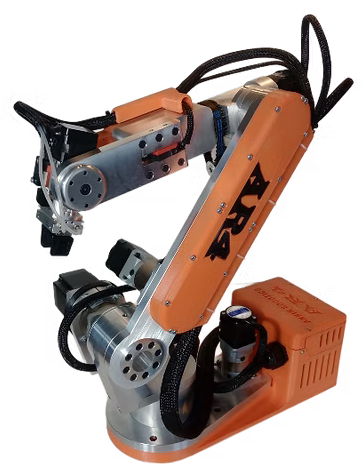

## Open Source Robotic Manipulators

<table>
  <tr>
    <th style="width: 200px;"></th>
    <th style="width: 200px;"><a href="https://github.com/TheRobotStudio/SO-ARM100/">Standard Open Arm 100 by TheRobotStudio  </th>
    <th style="width: 200px;"><a href="https://github.com/AngelLM/Thor">Thor by AngelLM  </th>
    <th style="width: 200px;"><a href="https://arctosrobotics.com/">Arctos </th>
    <th style="width: 200px;"><a href="https://emanual.robotis.com/docs/en/platform/openmanipulator_x/overview/">OpenManipulator-X by ROBOTIS </th>
    <th style="width: 200px;"><a href="https://www.anninrobotics.com/">AR4 by Annin Robotics</a> </th>
    <th style="width: 200px;"><a href="https://www.anninrobotics.com/">PAROL6 by Source Robotics </th>
  </tr>
  <tr>
    <td>Mechanical structure</td>
    <td>Articulated</td>
    <td>Articulated</td>
    <td>Articulated</td>
    <td>Articulated</td>
    <td>Articulated</td>
    <td>Articulated</td>
  </tr>
  <tr>
    <td>DOF</td>
    <td>5</td>
    <td>6</td>
    <td>6</td>
    <td>4</td>
    <td>6</td>
    <td>6</td>
  </tr>
  <tr>
    <td>Reach, mm</td>
    <td>n/a</td>
    <td>625</td>
    <td>600</td>
    <td>380</td>
    <td>629</td>
    <td>400</td>
  </tr>
  <tr>
    <td>Payload, kg</td>
    <td>n/a</td>
    <td>0.75</td>
    <td>0.5</td>
    <td>0.5</td>
    <td>1.9</td>
    <td>1</td>
  </tr>
  <tr>
    <td>Repeatability, mm</td>
    <td>n/a</td>
    <td>n/a</td>
    <td>n/a</td>
    <td>&lt; 0.2</td>
    <td>0.2</td>
    <td>0.2</td>
  </tr>
  <tr>
    <td>Weight, kg</td>
    <td>n/a</td>
    <td>n/a</td>
    <td>n/a</td>
    <td>0.7</td>
    <td>12.25</td>
    <td>5.5</td>
  </tr>
  <tr>
    <td>Requires CNC machining (linkages material)</td>
    <td>No</td>
    <td>No</td>
    <td>No</td>
    <td>Yes, aluminum</td>
    <td>Yes, aluminum</td>
    <td>No</td>
  </tr>
  <tr>
    <td>Motors type</td>
    <td>Servo</td>
    <td>Stepper</td>
    <td>Stepper</td>
    <td>Servo</td>
    <td>Stepper</td>
    <td>Stepper</td>
  </tr>
  <tr>
    <td>Last activity as of 20 Feb 2025, months ago</td>
    <td>1</td>
    <td>25</td>
    <td>1</td>
    <td>1</td>
    <td>8</td>
    <td>1</td>
  </tr>
  <tr>
    <td>Price</td>
    <td>128 EUR for parts (244 EUR for the teleoperation set)</td>
    <td>350 EUR for parts</td>
    <td>$433 forhardware kit + $360 for 3D printed parts</td>
    <td>$1417 for an assembled robot</td>
    <td>$1189 for the combo kit + $730 for the motor set + 3D printing covers and spacers</td>
    <td>3640 EUR for an assembled robot</td>
  </tr>
  <tr>
    <td>Kit availability</td>
    <td>no</td>
    <td>no</td>
    <td>yes</td>
    <td>no</td>
    <td>yes</td>
    <td>yes</td>
  </tr>
  <tr>
    <td>Extra features, notes</td>
    <td> Comes with a leader arm for teleoperation. Ready to be used with <a href="https://github.com/huggingface/lerobot/tree/main">LeRobot</a> </td>
    <td></td>
    <td></td>
    <td></td>
    <td></td>
    <td></td>
  </tr>
</table>
