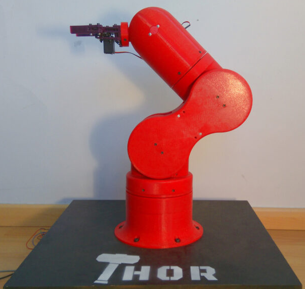

# Open Source Robotic Manipulators

| Name & Link | Image | Mechanical Structure | DOF | Reach (mm) | Payload (kg) | Repeatability (mm) | Weight (kg) | CNC Machining | Motor Type | Last Activity (Feb 2025) | Price | Kit Availability | Extra Features/Notes |
|------------|-------|---------------------|-----|------------|--------------|-------------------|-------------|---------------|------------|------------------------|--------|------------------|-------------------|
| [Standard Open Arm 100](https://github.com/TheRobotStudio/SO-ARM100/) |  | 3D Printed | 5 | n/a | n/a | n/a | n/a | No | Servo | Yes | 128 EUR parts + 3D printing (244 EUR teleoperation set) | No | Comes with teleoperation leader arm. Ready for [LeRobot](https://github.com/huggingface/lerobot/tree/main) |
| [Thor](https://github.com/AngelLM/Thor) |  | 3D Printed | 6 | 625 | 0.75 | n/a | n/a | No | Stepper | No (Dec 2023) | 350 EUR parts | No | - |
| [Arctos](https://arctosrobotics.com/) |  | 3D Printed | 6 | 600 | 0.5 | n/a | n/a | No | Stepper | Yes | $433 hardware + $360 3D parts | Yes | - |
| [OpenManipulator-X](https://emanual.robotis.com/docs/en/platform/openmanipulator_x/overview/) |  | Aluminum | 4 | 380 | 0.5 | < 0.2 | 0.7 | Yes | Servo | Yes | $1417 assembled | No | - |
| [AR4](https://www.anninrobotics.com/) |  | Aluminum | 6 | 629 | 1.9 | 0.2 | 12.25 | Yes | Stepper | Yes | $1189 combo + $730 motors + 3D printing | Yes | - |
| [PAROL6](https://source-robotics.com/products/parol6-robotic-arm) |  | 3D Printed | 6 | 400 | 1 | 0.2 | 5.5 | No | Stepper | Yes | 2418 EUR combo + 3D printing | Yes | - |

## Discovered projects that were not included:
- [BCN3D MOVEO](https://github.com/BCN3D/BCN3D-Moveo)
- [Source Robotics FAZE4](https://github.com/PCrnjak/Faze4-Robotic-arm)
- [Low-Cost Robot Arm](https://github.com/AlexanderKoch-Koch/low_cost_robot)
- [Low-Cost Robot Arm: Koch v1.1](https://github.com/jess-moss/koch-v1-1)
